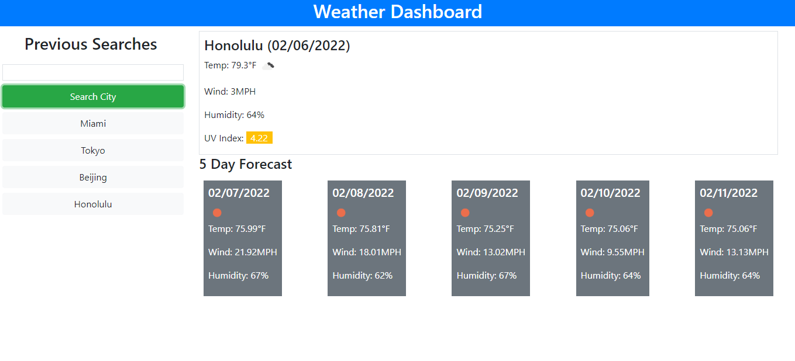
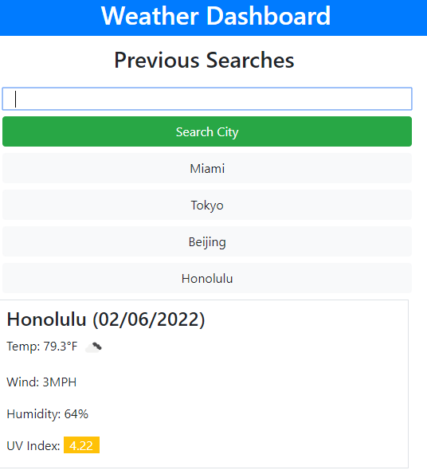

# Weather Dashboard

This application allows the user to search for the weather in any given city and see current conditions as well as a 5-day forecast.  Their previous searches are stored and can be seen again by clicking on the corresponding button.  The application was built to be mobile responsive using the Bootstrap framework.  Weather data is pulled from the [OpenWeather API](https://openweathermap.org).

# Screenshots

The application when viewed on a desktop screen

The application when viewed on a mobile screen

